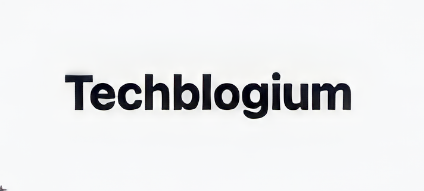

[](https://choosealicense.com/licenses/mit)




#


#

## Table of Contents

* [Description](#description)

* [Installation](#installation)
* [Usage](#usage)
* [Walkthrough](#walkthrough-video)
* [Link](#link)
* [Authors](#authors)
* [License](#license)
#

## Description

Welcome to Techblogium, the ultimate destination for all tech enthusiasts! Whether you're a gadget aficionado, a tech guru, or simply curious about the latest technological wonders, you've come to the right place. Techblogium is not just a blog; it's a vibrant community where you can dive into the world of technology, read captivating articles, and engage in meaningful discussions.

At Techblogium, we believe in the power of knowledge and the joy of sharing ideas. Our dedicated team of tech-savvy writers, researchers, and experts work tirelessly to bring you the most exciting and informative content. From in-depth product reviews and insightful editorials to thought-provoking analyses and news updates, our blog covers a wide range of topics that will keep you at the forefront of the tech revolution.

But Techblogium isn't just about one-way communication. We value your opinions and encourage active participation. Feel free to leave comments, share your thoughts, and engage in lively discussions with fellow readers. We believe that collective intelligence fosters innovation, and your perspective matters.

Join our ever-growing community and embark on a journey through the captivating world of technology. Stay up to date with the latest trends, discover mind-blowing innovations, and let your curiosity guide you. Techblogium is here to inform, inspire, and connect like-minded individuals who are passionate about the endless possibilities of the digital age.

So, grab your virtual seat, explore our diverse range of articles, and immerse yourself in the ever-evolving world of technology. Welcome to Techblogium, where knowledge meets community!
#
## Installation

You can clone the git repository and run next command to use tha web application locally

Install all dependencies

```
  npm install
```

Seed the database

```
  npm run seed
```

Start the server

```
  npm run start
```
#
## Usage
In order to use the program you will need to clone the repository from GitHub provided in the link below.

#
## How to Contribute
For and suggestions or contributions you can reach me at my email address or you can clone to code and edit it the way it will suite you the best.
#
## Walkthrough Video

[](https://drive.google.com/file/d/15RBCeoPsACsRICL28xkjZCmyn8rR6hWf/view?usp=sharing)
#


## Link
Link to repository:

https://github.com/kristiyantefov/Techblogium

Link to website:


https://techblogium.herokuapp.com
#
## Authors

- [Kristiyan](https://github.com/kristiyantefov)

#
## License

- This application is covered under: [MIT License](https://choosealicense.com/licenses/mit)

